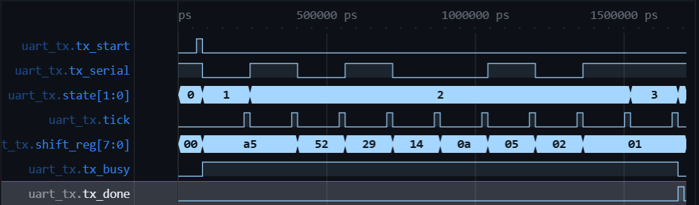
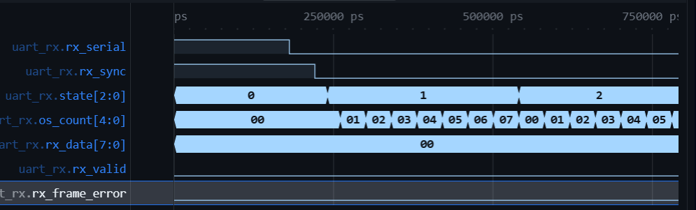
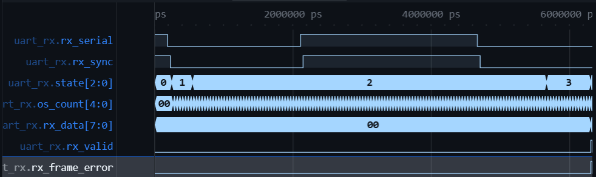
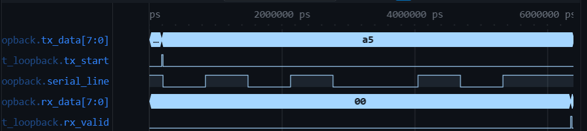

# UART Transceiver with cocotb Verification

[](https://github.com/ali-abdl/uart-verilog-cocotb/actions/workflows/ci.yml)

A full-duplex UART written in Verilog, together with a [cocotb](https://www.cocotb.org/) testbench
that does the actual verifying: a driver, a monitor, a scoreboard, randomised stimulus, and
functional coverage that gets closed rather than just measured.

There are 15 tests across 4 suites and they run on every push through GitHub Actions using
[Icarus Verilog](https://steveicarus.github.io/iverilog/). If you open the repo in a Codespace, the
devcontainer installs the toolchain for you and `python3 scripts/run_regression.py` will work
straight away.

The testbench ended up being a bigger piece of work than the RTL.

---

## Contents

- [What's here](#whats-here)
- [The protocol](#the-protocol)
- [The design](#the-design)
  - [`baud_gen`](#baud_gen)
  - [`uart_tx`](#uart_tx)
  - [`uart_rx`](#uart_rx)
  - [`uart`](#uart)
- [Verification](#verification)
  - [Testbench structure](#testbench-structure)
  - [The tests](#the-tests)
  - [Random stimulus](#random-stimulus)
  - [Coverage](#coverage)
  - [Bug injection](#bug-injection)
- [Waveforms](#waveforms)
- [CI](#ci)
- [Running it](#running-it)
- [Design decisions](#design-decisions)
- [What it doesn't do](#what-it-doesnt-do)

---

## What's here

```
rtl/                     synthesisable design
  baud_gen.v             gated bit-time / oversample tick generator
  uart_tx.v              transmitter FSM
  uart_rx.v              receiver FSM, 16x oversampling
  uart.v                 full-duplex top level

tb/                      testbenches + shared verification code
  scoreboard.py          expected-vs-actual checker
  coverage.py            functional coverage collector
  dump.v                 VCD capture (sim only)
  uart_loopback.v        harness that ties tx_serial to rx_serial
  test_*.py              one testbench per DUT

sim/                     one directory per DUT, plus common.mk
scripts/run_regression.py
docs/waveforms/
.github/workflows/ci.yml
```

Only code that could plausibly become gates lives in `rtl/`. The waveform dumper and the loopback
harness are simulation-only, so they sit in `tb/` instead.

---

## The protocol

UART is asynchronous, meaning there is no clock line anywhere in the interface. Both ends agree on a
bit rate ahead of time and then each one counts time by itself. So that the receiver can work out
where a byte begins and ends, every byte is wrapped in a frame:

```
        ┌─ idle ─┐                                                    ┌─ idle ─
────────┘        │                                                    │
                 └──start──┬──d0──┬──d1──┬─ ... ─┬──d7──┬────stop──────┘
                  (always   └──── 8 data bits, LSB first ───┘  (always
                    LOW)                                        HIGH)
```

Idle is high. A start bit pulls the line low for one bit-time, the eight data bits follow with the
least significant one first, and a stop bit puts the line back high. That arrangement is called 8N1:
eight data bits, no parity, one stop bit.

The awkward part is that the receiver cannot follow edges. Send `0x00` and the line stays low through
the start bit and all eight data bits, which is nine bit-times without a single transition anywhere.
`0xFF` does the same thing the other way up. Because the data gives you nothing dependable to lock
onto, the receiver has to count time from the falling edge of the start bit, that being the only edge
every frame is guaranteed to contain.

Which sets up a timing budget. The stop bit gets sampled 9.5 bit-times after the start edge, so drift
between the two clocks has to stay under half a bit-time for that sample to land in the right place:

```
0.5 / 9.5 ≈ 5.3% combined tolerance
```

A pair of ±2% crystals fits comfortably inside that. It only works because sampling happens at the
centre of each bit, though. Move the sample points out towards the bit boundaries and most of the
margin disappears.

---

## The design

```
                    ┌────────────────────────────────────────┐
                    │                uart.v                  │
   tx_start ───────▶│  ┌──────────┐                          │
   tx_data[7:0] ───▶│  │ uart_tx  │──┬──▶ baud_gen (gated)   │──▶ tx_serial
   tx_busy    ◀─────│  │   FSM    │  │                       │
   tx_done    ◀─────│  └──────────┘  │                       │
                    │                                        │
   rx_serial ──────▶│  ┌──────────┐  2-FF sync               │
   rx_data[7:0] ◀───│  │ uart_rx  │──┬──▶ baud_gen (16x)     │
   rx_valid   ◀─────│  │   FSM    │  │                       │
   rx_frame_error ◀─│  └──────────┘                          │
                    └────────────────────────────────────────┘
```

Every module is parameterised by `CLKS_PER_BIT`, and the defaults target 50 MHz with 115200 baud,
since `50_000_000 / 115_200` works out to about 434 clocks per bit. The simulations override that
with much smaller numbers so tests finish quickly and the waveforms stay readable.

### `baud_gen`

A clock divider with an enable on it. It counts `DIVISOR` cycles and emits a `tick` one cycle wide.

| Port | Dir | Width | |
|---|---|---|---|
| `clk` | in | 1 | |
| `rst_n` | in | 1 | active-low reset |
| `en` | in | 1 | when low, the counter is held at zero and `tick` is suppressed |
| `tick` | out | 1 | one-cycle pulse every `DIVISOR` clocks |

`tick` is an enable pulse and not a divided clock, which matters more than it looks. Generating a slow
50%-duty clock and then using it as a clock would introduce a second clock domain, along with all the
timing-closure trouble that brings. One fast clock plus enable pulses sidesteps the whole problem.

### `uart_tx`

Four states and a shift register.

```
   IDLE ──tx_start──▶ START ──1 bit──▶ DATA ──×8──▶ STOP ──1 bit──▶ IDLE
  line=1             line=0           shift        line=1
```

| Port | Dir | Width | |
|---|---|---|---|
| `tx_start` | in | 1 | one-cycle pulse meaning "send `tx_data`" |
| `tx_data` | in | 8 | captured when `tx_start` asserts |
| `tx_serial` | out | 1 | serial output |
| `tx_busy` | out | 1 | high for the whole frame |
| `tx_done` | out | 1 | one-cycle pulse once the stop bit finishes |

Since UART sends the least significant bit first, the byte gets loaded into a register that shifts
right on every bit-time, which keeps the bit currently being transmitted at position 0.

`tx_busy` and `tx_done` are there to give the block a handshake. Without some form of back-pressure
there is no way for anything upstream to know when the next byte can safely be handed over, and the
block stops being reusable.

### `uart_rx`

Five states, and 16× oversampling to recover the timing.

```
   IDLE ──rx low──▶ START ──8 ticks──▶ DATA ──×8 (16 ticks each)──▶ STOP
     ▲               │  (validate)                                    │
     │               └── line high again → false start, abort         │
     │                                                                │
     ├────────────────────── stop bit high ───────────────────────────┤
     │                                                                │
     └── RECOVER ◀────────── stop bit low (framing error) ────────────┘
          (wait for line to go high again)
```

| Port | Dir | Width | |
|---|---|---|---|
| `rx_serial` | in | 1 | serial input, asynchronous to `clk` |
| `rx_data` | out | 8 | decoded byte |
| `rx_valid` | out | 1 | one-cycle pulse saying `rx_data` is good |
| `rx_frame_error` | out | 1 | the stop bit was not high |

An internal tick runs 16 times faster than the bit rate. When the start edge shows up the oversample
counter is cleared, and 8 ticks later the receiver is sitting at the centre of the start bit. Every 16
ticks after that lands on the centre of the next bit.

The line then gets checked a second time at that centre point. If it has already gone high the
transition was noise rather than a real start bit, and the receiver drops back to idle without
producing anything. Skipping that check is a fairly common shortcut, and it means any glitch on an
idle line turns into a garbage byte.

When the stop bit is not high, `rx_frame_error` asserts alongside `rx_valid` and the byte is reported
anyway, on the basis that flagging a suspect frame is the receiver's job while deciding what to do
about it is software's. After that the FSM moves into `RECOVER` and refuses to look for another start
bit until the line comes back high. Leave that state out and a line stuck low will raise a framing
error, return to IDLE, immediately read the low line as a fresh start bit, and go on producing
phantom bytes forever.

One more thing worth mentioning: `rx_serial` arrives from off-chip and can change at exactly the
moment a flip-flop is sampling it. It passes through a two-flip-flop synchroniser first so a
metastable value can never reach the state machine.

### `uart`

A structural wrapper that instantiates `uart_tx` and `uart_rx` with a shared `CLKS_PER_BIT`. There is
no logic in it at all, just wiring.

---

## Verification

### Testbench structure

```
   stimulus ──▶ driver ──▶ [ DUT ] ──▶ monitor ──▶ scoreboard ──▶ pass/fail
       │                                              ▲
       └──────────── expected value ──────────────────┘
```

The driver applies stimulus and remembers what it sent. The monitor runs in the background watching
the DUT's output, with no knowledge of what the driver is up to. Between them sits the scoreboard,
comparing the two streams and counting mismatches.

Keeping the monitor ignorant is the part that carries the weight. If it peeked at control signals to
decide when to sample, some of the check would collapse into verifying the design against itself.

On the transmitter side the monitor is a UART receiver written in Python: it hunts for the start bit,
samples at the bit centres and reassembles the byte. On the receiver side the driver is a Python UART
transmitter. So both halves of the protocol exist twice over, once in Verilog and once in Python,
written separately. The loopback suite then throws the Python model away entirely and checks the two
Verilog implementations against each other.

### The tests

| Suite | Test | What it checks |
|---|---|---|
| `baud_gen` | `test_tick_period` | `tick` fires exactly every `DIVISOR` cycles |
| | `test_disabled_holds_low` | `en` low really does suppress ticks |
| `uart_tx` | `test_single_byte` | a byte turns into a correct frame |
| | `test_bit_order_and_patterns` | `0x01`/`0x80` catch bit-order bugs, `0x00`/`0xFF` cover flat runs |
| | `test_busy_and_done_handshake` | `tx_done` pulses exactly once, `busy` drops on the same cycle |
| | `test_randomized` | 200 random bytes, random gaps, all scoreboard-checked |
| `uart_rx` | `test_single_byte` | a clean frame decodes |
| | `test_patterns` | bit ordering and flat runs |
| | `test_framing_error` | a low stop bit raises the flag, byte still reported |
| | `test_recovery_after_error` | the next good frame still decodes |
| | `test_glitch_rejected` | a quarter-bit glitch produces no byte |
| | `test_randomized` | 100 random bytes, random gaps |
| | `test_coverage_closure` | randomise, find the uncovered bins, close them directly |
| `loopback` | `test_loopback_single` | one byte survives TX → wire → RX |
| | `test_loopback_random` | 100 random bytes make the round trip cleanly |

The byte patterns were picked against particular failure modes. `0xA5` was my first test value and it
turns out to be a weak one on its own, because `10100101` reversed is still `10100101`, so a shift
register running backwards would have sailed through. `0x01` and `0x80` catch it immediately. `0x00`
and `0xFF` are the two cases where the line has the fewest transitions to work with.

### Random stimulus

Both the data and the timing get randomised. Randomising the gap between frames turned out to matter
more than randomising the data, since the tightest case in the whole design is a new frame starting
right as the previous one finishes draining, and that is where a stale counter or a missed transition
would show itself.

cocotb prints its seed on every run, so anything that fails can be reproduced:

```
Seeding Python random module with 1787161899
```

```bash
make RANDOM_SEED=1787161899
```

### Coverage

Collected by `tb/coverage.py`. The test fails if any group comes in under 100%, so coverage is a
pass/fail condition rather than a number in a log.

| Group | Bins | Result |
|---|---|---|
| `data_value` | all 256 byte values | 256/256, 100% |
| `gap` | back-to-back / short / long | 3/3, 100% |
| `frame` | clean / framing error | 2/2, 100% |

The more interesting number comes from partway through, after the randomised phase and before
anything has been closed:

```
after randomization: data_value at 20.7%, 203 holes remaining
```

Sixty random samples spread across 256 bins landing near 20% is roughly what the coupon collector
problem predicts, and it is the reason "I ran a lot of random tests" is not a coverage claim. The test
reads the uncovered bins back out of the coverage object and drives exactly those values, so the
closure is driven by the measurement rather than by guesswork.

### Bug injection

Everything passing did not tell me much until I had checked that the tests were capable of failing.
So I broke the transmitter on purpose. One character:

```verilog
tx_serial <= shift_reg[0];   // should be shift_reg[1]
```

Three of the four TX tests failed and both loopback tests failed with them. The scoreboard output
pinned down the fault without my having to open the RTL: every byte came back as
`(value << 1) | value[0]`, which says the first data bit was going out twice and bit 7 was falling off
the end.

`test_busy_and_done_handshake` carried on passing, which is the right answer, since the bug corrupts
data without touching control flow. Tests that fail independently of one another are what lets you
narrow down where a problem actually lives.

---

## Waveforms

### Transmitter, one frame



`tx_start` pulses for a cycle, `state` walks through `IDLE → START → DATA → STOP` with DATA taking
eight bit-times, and `shift_reg` empties out from the bottom as bits leave
(`a5 → 52 → 29 → 14 → 0a → 05 → 02 → 01`). `tx_done` pulses once at the very end.

Some of the ticks produce no change on `tx_serial` at all. Those are bit boundaries where two
consecutive bits happen to be the same value, which is the concrete version of why the receiver cannot
recover timing from edges.

### Receiver, start-bit alignment



Three things are visible here at once. `rx_sync` lags `rx_serial` by two cycles, which is the
synchroniser. In START, `os_count` runs `00` up to `07`, the half-bit wait that puts the receiver on
the start bit's centre. Then DATA begins, `os_count` resets, and from there it counts full 16-tick bit
periods from a position that is already centre-aligned.

### Receiver, framing error



The stop bit is driven low. `rx_frame_error` asserts alongside `rx_valid`, and the decoded byte still
turns up on `rx_data`. The FSM then sits waiting for the line to return high before it will accept
another start bit.

### Loopback, full round trip



`tx_data = 0xA5` goes into the transmitter, becomes a framed waveform on `serial_line`, and comes back
out on `rx_data` when `rx_valid` pulses. No Python is involved in the protocol here. This is the
transmitter talking to the receiver.

---

## CI

`.github/workflows/ci.yml` runs on every push and pull request. It installs Icarus on a clean Ubuntu
runner, installs the pinned dependencies, runs the regression, and uploads `results.xml` as an
artifact even when things have failed.

There is a trap here that caught me. cocotb's Makefile does not reliably return a non-zero exit code
when tests fail, so running `make` on its own is no good as a CI gate: it will report green on a
broken design. `scripts/run_regression.py` handles it instead. It deletes any existing `results.xml`
before building so that a failed build cannot report stale results from the run before, it treats a
missing `results.xml` as a failure and prints `make`'s exit code, it parses the JUnit XML and counts
real `<failure>` elements, and it exits non-zero if anything failed.

That first point is not hypothetical. An earlier version of the script left the delete out and
cheerfully reported `15 passed` on a run where the build had failed and not one test had executed.

```
============================================================
  REGRESSION SUMMARY
============================================================
SUITE           PASS  FAIL  STATUS
baud_gen           2     0  OK
uart_tx            4     0  OK
uart_rx            7     0  OK
loopback           2     0  OK
------------------------------------------------------------
TOTAL             15     0
```

---

## Running it

### Codespaces

Open the repo in a Codespace and the devcontainer will install Icarus Verilog, GTKWave, a virtualenv
with cocotb in it, and the Verilog and waveform-viewer extensions.

```bash
python3 scripts/run_regression.py
```

### Locally

You need Icarus Verilog 11 or later and Python 3.8 or later.

```bash
sudo apt-get install -y iverilog
python3 -m venv .venv && source .venv/bin/activate
pip install -r requirements.txt
python3 scripts/run_regression.py
```

### A single suite, or a single test

```bash
cd sim/uart_rx && make                              # whole suite
cd sim/uart_rx && make TESTCASE=test_framing_error  # one test
cd sim/uart_rx && make RANDOM_SEED=1787161899       # reproduce a random run
```

Each run drops a `waves.vcd` in that simulation directory. GTKWave will open it, as will the VaporView
VS Code extension if you would rather stay in the browser.

---

## Design decisions

**Gated baud generator on the TX, free-running on the RX.** `tx_start` can turn up at any point in the
divider's count. If the transmitter left IDLE at whatever phase happened to be current, the start bit
would come out the wrong length and every bit after it would inherit the skew. Holding the counter at
zero while idle and releasing it at the moment the frame starts makes the timing exact instead.

The receiver goes the other way. Its generator free-runs at 16× and alignment comes from clearing the
oversample counter when the start edge arrives, which leaves a worst-case error of one sixteenth of a
bit, comfortably inside the budget worked out earlier.

A single free-running 16× generator shared between both sides is the more common production choice and
uses a little less logic. I went with the gated version because exact timing was easier for me to
reason about while learning, and easier to write assertions against.

**`baud_en = tx_busy | tx_start`.** `tx_busy` is a register, so it does not go high until a cycle after
`tx_start` arrives. Gating the counter on `tx_busy` alone starts it one cycle late and stretches the
start bit by that much. ORing in `tx_start` gets it moving on the same edge the frame does.

**`shift_reg[1]` rather than `shift_reg[0]`.** In the DATA state the shift and the output assignment
happen on the same clock edge, and because both use non-blocking assignment they both read the
pre-shift register. The bit that will sit at position 0 after the shift completes is currently at
position 1. Reading `shift_reg[0]` retransmits the bit you just sent, which is the bug used for the
injection test above.

**Single-process FSM style.** Next-state logic and outputs live in one clocked block. The two-process
style shows up more often in textbooks and lets outputs respond combinationally, but this version is
shorter and every output comes out registered, so nothing glitches. Both styles get used in practice.

**16× oversampling.** It is the historical standard, going back to the 16550, it is a power of two so
the division costs nothing in hardware, and it gives alignment accurate to a sixteenth of a bit. Going
to 8× halves the margin. Going to 32× needs a faster internal clock and buys very little.

**The synchroniser resets to 1.** A UART line idles high, so resetting those flip-flops to 0 would look
exactly like a start bit and produce a phantom frame every time the design came out of reset.

---

## What it doesn't do

The scope was deliberately narrow, so a fair amount is missing.

It only speaks 8N1, with no parity, a fixed 8-bit data width and a single stop bit. There are no
FIFOs, so both interfaces are single-byte and whatever drives them has to respect `tx_busy` and
consume `rx_data` when `rx_valid` pulses. The baud rate is set at compile time through `CLKS_PER_BIT`
and cannot be changed from a register.

There is no overrun detection either, so a second byte arriving before the first has been read will
overwrite `rx_data` with no flag raised. A line held low past a full frame reports as a framing error
rather than as a distinct break condition, which a more complete UART would separate out.

Coverage is functional only. No code, toggle or FSM-state coverage, since Icarus does not provide any
of it; that would need a commercial simulator or Verilator.

If I extend this, the order would be parity first, then RX and TX FIFOs with overrun and underrun
flags, then a register-mapped bus interface such as AXI4-Lite or Wishbone, and eventually
SystemVerilog Assertions for the protocol properties that are currently checked procedurally in
Python.

---

## Background

I am an Engineering Physics student at McMaster University. Before this I had done embedded work in
C++, including [an I²C sensor driver with complementary-filter fusion](https://github.com/ali-abdl/mpu6050-i2c-driver),
but no HDL at all.

UART seemed like the right thing to start with because the design is small enough to understand
completely while the receiver is genuinely not trivial: recovering timing without a clock is a real
problem rather than a made-up exercise. cocotb was the other half of the appeal, since I wanted the
verification work to be the larger part of the project.

---

## Licence

MIT, see [LICENSE](LICENSE).
